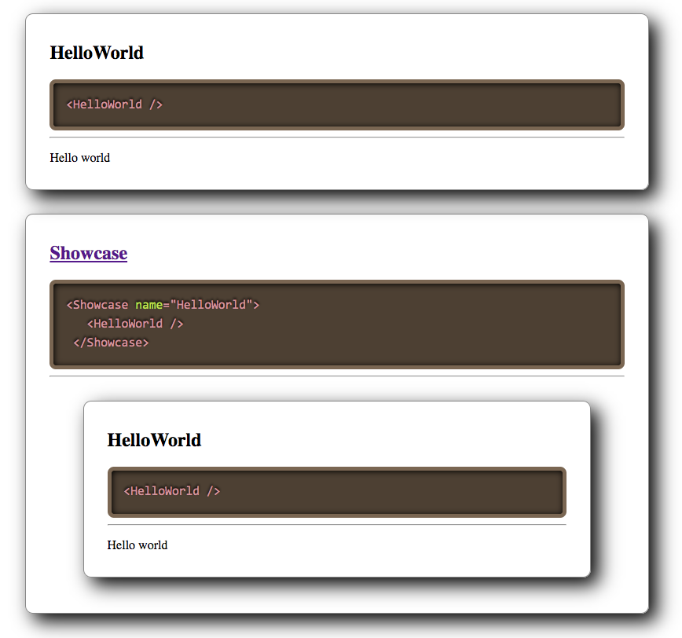

# react-showcase
React component that showcases a React component's code with its output


## Install

```
npm install --save react-showcase
```

## Usage

```jsx
import React from 'react';
import ReactDOM from 'react-dom';

import Showcase from 'react-showcase';

function HelloWorld() {
    return ( <p> Hello world </p> );
}

ReactDOM.render(
    <main>
        <Showcase name="HelloWorld">
            <HelloWorld />
        </Showcase>
        <Showcase name="Showcase" source="https://github.com/pepellou/react-showcase">
            <Showcase name="HelloWorld">
                <HelloWorld />
            </Showcase>
        </Showcase>
    </main>,
    document.getElementById('root')
);
```

That will render:




## Options

- `name` - _string_ The name of the React Component to showcase (**required**)
- `source` or - _string_ Url to link to the component website (default: null)
- `ignore` - _array_ List of properties to ignore when displaying the JSX of the component (default: [])


## Developing

```bash
git clone git@github.com:pepellou/react-showcase.git
cd react-showcase
npm install
npm start
```

## License

MIT (c) 2020 Pepe Doval
